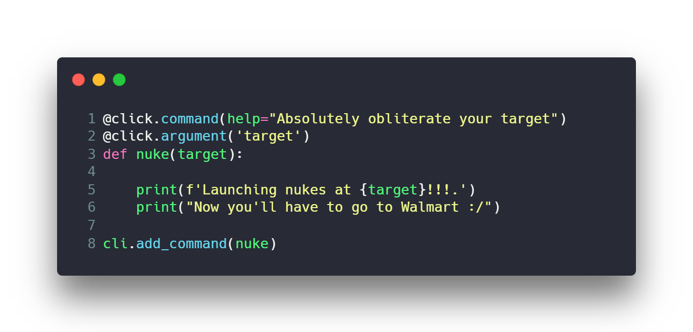
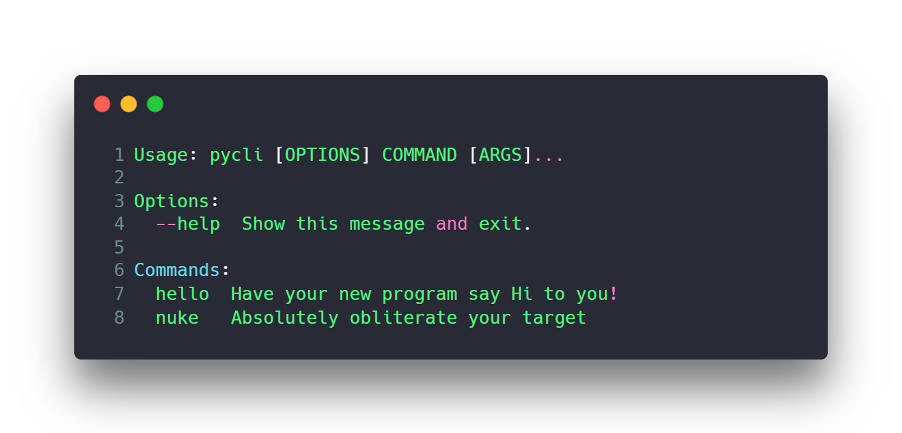

# pycli

Pycli is a barebones template and boilerplate for a command line python application. Basically because I needed one.




## Requirements

* Python
* setuptools
* click

## Installation

Clone the package with

```bash
git clone https://github.com/grplyler/pycli.git
```

Then install the following **requirements**

```bash
pip install setuptools click
```


## Usage

1. First visit the setup.py and update project details

    ```python
    from setuptools import setup, find_packages

    setup(
        name="pycli",
        description="A Python CLI Starter Template",
        version="0.1",
        author="Ryan Plyler <grplyler@liberty.edu>",
        packages=find_packages(),
        install_requires=[
            "click",
        ],
        entry_points={
            "console_scripts": [
                "pycli = pycli.cli:cli"
            ]
        },
    )
    ```

2. The visit the `pycli/cli.py` module to add some commands. This template uses the [Click](https://click.palletsprojects.com/en/7.x/) library for simple, beautiful, command line interfaces, by the same guys that made [Flask](https://flask.palletsprojects.com/en/1.1.x/)

    ```python
    @click.command(help="Absolutely obliterate your target")
    @click.argument('target')
    def nuke(target):

        print(f'Launching nukes at {target}!!!.')
        print("Now you'll have to go to Walmart :/")

    cli.add_command(nuke)
    ```

3. Finally, in your terminal or command prompt, run the for development mode (you won't have to reinstal cli tool to reflect new changes as you develop):

    ```bash
    python setup.py develop
    ```

    or for production

    ```bash
    python setup.py install
    ```

4. This automatially creates a symlink to your program. Run and check the output!

    ```bash
    Usage: pycli [OPTIONS] COMMAND [ARGS]...

    Options:
    --help  Show this message and exit.

    Commands:
    hello  Have your new program say Hi to you!
    nuke   Absolutely obliterate your target
    ```

## Conventions

This template aims to reflect python standards and best practices by having a proper module and package oriented structure. But feel free to customize for your own needs!

## Contributing
Pull requests are welcome. For major changes, please open an issue first to discuss what you would like to change.

## Community

If you use this boilerplate for something cool, shoot me an email! I'd love you hear what you made!

## Credits

**Super Cool Code Images** by [Carbon](https://carbon.now.sh/)

## License
[MIT](https://choosealicense.com/licenses/mit/)